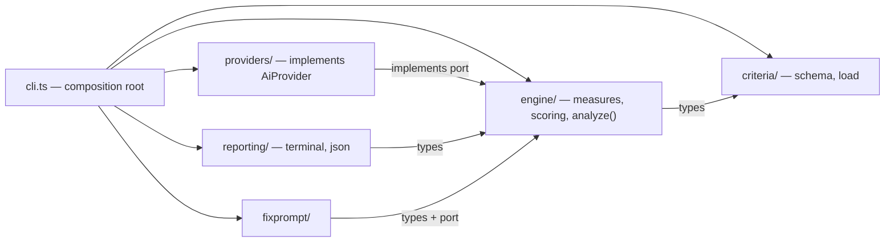

# Architecture

Sifty scores one AI-tool instruction file — a `.instructions.md`, a
`copilot-instructions.md`, later a `CLAUDE.md` or `SKILL.md` — on five axes
and tells you what to fix first. Architecturally it is one function:

    analyze(content, criteria) → report

Everything else in this repository exists to keep that function pure,
testable, and the criteria out of the code. This file is the _why_. The
rules an agent must follow are in `AGENTS.md`; what ESLint enforces is in
`docs/architecture/dependency-rules.md`; the vocabulary is in
`docs/architecture/glossary.md`.

## Four decisions

### 1. Criteria are data, the five axes are code — [ADR-0002](docs/adr/0002-criteria-are-data-axes-are-code.md)

A tool's rule set lives in `config/<tool>.json`: its checks, weights,
thresholds, presets, file kinds, grade bands. Adding a tool, a check, or
recalibrating a threshold is a JSON change and nothing else. The engine
contains no tool-specific `if`.

The five axes (`clarity`, `structure`, `completeness`, `cost`, `security`)
are the one thing that is _not_ data: they are Sifty's product identity, the
compiler enforces that every preset weights all five, and no planned feature
needs a sixth. A sixth axis is a code change, on purpose.

### 2. The engine is pure — [context-map.md](docs/architecture/context-map.md)

`src/engine/**` knows no file system, no `process`, no network, no SDK.
`analyze()` takes an already-loaded config object and file content and
returns a report. Only `src/cli.ts` — the composition root — reads files,
env vars and flags, builds the provider, and prints.

This is what lets a test or a future web UI call `analyze()` with nothing
but an object. ESLint rule R2 makes it a lint error, not a convention.

### 3. AI is behind a port — [ADR-0003](docs/adr/0003-ai-provider-port.md)

The engine defines `AiProvider` (`src/engine/ai-provider.ts`): one
`complete()` call with a system prompt, a user prompt, a Zod schema and a
token budget. `src/providers/anthropic.ts` is the only file that imports
the Anthropic SDK. Prompt-building, validation, the one retry, and scoring
never see a vendor type.

A second provider (EU cloud, self-hosted, local) is one new file under
`src/providers/` plus a CLI flag. ESLint rule R1 keeps the SDK out of
everything else.

### 4. A blocker caps the score, it does not zero it — [ADR-0004](docs/adr/0004-blocker-cap.md)

A check with `severity: "blocker"` (today: a leaked secret, an internal
hostname) that does not score 100 caps the overall score at
`security.blockerCapsOverallAt` (40), regardless of preset. The uncapped
value stays on the report as `cappedFrom`, and every other finding stays
visible. Four good axes cannot average a secret away; one secret does not
hide everything else.

## The map

Dependencies point one way: `criteria → engine → {providers, reporting,
fixprompt} → cli`. The full table of what each module may and must not
import is in `docs/architecture/context-map.md`.

## Who enforces what

| Rule                                                   | Enforced by                                                                |
| ------------------------------------------------------ | -------------------------------------------------------------------------- |
| Import direction, SDK isolation, engine purity         | `eslint.config.js` (R1–R6) — `npm run lint`                                |
| Config shape, ranges, cross-references, regex validity | `src/criteria/schema.ts` at load time                                      |
| Scores don't move without intent                       | `src/engine/golden.test.ts` pins real scores against `config/copilot.json` |
| `criteriaVersion` bump when a score moves              | review — see `AGENTS.md`                                                   |
| All of the above on every PR                           | `.github/workflows/ci.yml`                                                 |

## Changing things

| I want to…                        | I touch                                                                       | I don't touch                       |
| --------------------------------- | ----------------------------------------------------------------------------- | ----------------------------------- |
| add a tool                        | `config/<tool>.json`, golden fixtures                                         | `src/engine/**`                     |
| add a provider                    | `src/providers/<name>.ts`, a flag in `src/cli.ts`                             | `src/engine/**`, `src/fixprompt/**` |
| recalibrate weights or thresholds | `config/<tool>.json` + bump `criteriaVersion`, regenerate golden expectations | code                                |
| add an output format              | `src/reporting/<format>.ts`, `--format` in `src/cli.ts`                       | the `Report` type                   |

## Deliberately not built

No DI container (three hand-wired dependencies in `src/cli.ts` are clearer). No
plugin system for measures (the typed registry is checked by the compiler).
No generic axes (see decision 1). No `ports/adapters/domain` folder
ceremony (four contexts of 1–4 files each). No classes (the code is
functions over data). A package split for a web UI only when it brings its
own dependencies — `analyze()` without a file system is enough until then.
