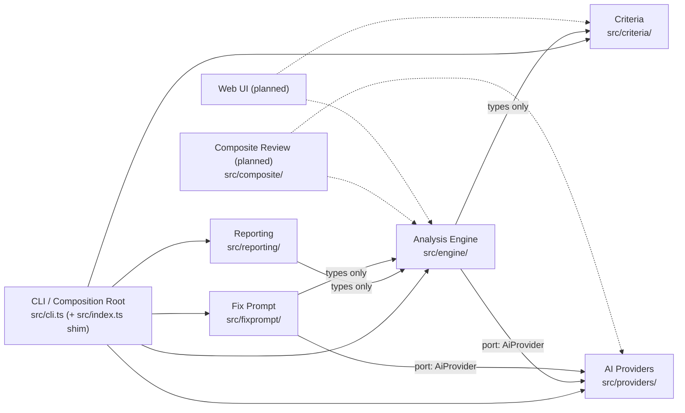

# Context map

| Context                                          | Responsibility                                                                                    | Public API                                                                                                         | May import                                                                      | Must not import                                                                                             |
| ------------------------------------------------ | ------------------------------------------------------------------------------------------------- | ------------------------------------------------------------------------------------------------------------------ | ------------------------------------------------------------------------------- | ----------------------------------------------------------------------------------------------------------- |
| **Criteria** (`src/criteria/`)                   | Schema, loading, validation, file-kind detection                                                  | `loadCriteria`, `validateCriteria`, `detectFileKind`, `criteriaConfigSchema`, the `CriteriaConfig`/`Check`/… types | `node:fs`/`path`/`url`, `picomatch`, `zod`                                      | `engine/`, `providers/`, `reporting/`, `fixprompt/`                                                         |
| **Analysis Engine** (`src/engine/`)              | Text prep, mechanical measures, bundled AI checks, scoring, `analyze()`                           | `analyze`, `prepareFile`, `runMechanicalChecks`, the `AiProvider` port, `Report`/`AnalyzeResult` types             | `criteria/` (types), `gray-matter`, `picomatch`, `zod`                          | `node:fs`/`path`/`url`, `chalk`, `commander`, `dotenv`, `providers/`, `reporting/`                          |
| **AI Providers** (`src/providers/`)              | Implement the `AiProvider` port for one real backend                                              | `createAnthropicProvider`                                                                                          | `@anthropic-ai/sdk`, `zod`, `engine/` (the port type)                           | `criteria/`, `reporting/`, `cli.ts`                                                                         |
| **Fix Prompt** (`src/fixprompt/`)                | Turn a `Report`'s fix list into a ready-to-use prompt, via the port                               | `generateFixPrompt`                                                                                                | `engine/` (types + port), `zod`                                                 | SDKs, `chalk`, `node:fs`/`path`/`url`                                                                       |
| **Reporting** (`src/reporting/`)                 | `Report` → terminal text or JSON                                                                  | `formatTerminal`, `formatJson`                                                                                     | `chalk` (terminal.ts only in practice), `report.types`                          | `engine/*` (types only — enforced by `@typescript-eslint/no-restricted-imports`), `criteria/`, `providers/` |
| **CLI** (`src/cli.ts`, `src/index.ts`)           | Flags, env, file I/O, wiring, exit codes, printing                                                | the `sifty` binary                                                                                                 | everything                                                                      | — (the one place allowed to import anything except the SDK directly)                                        |
| **Composite Review** (planned, `src/composite/`) | Analyze several files together — contradictions, duplicated rules, overlapping triggers, no score | not yet built                                                                                                      | `engine/` (reuse `prepareFile`), `providers/` (via the port)                    | —                                                                                                           |
| **Web UI** (planned)                             | Same engine, different presentation                                                               | not yet built                                                                                                      | `engine/` (`analyze()` needs only a config object and content — no file system) | —                                                                                                           |

See `dependency-rules.md` for how each arrow above is enforced (or explicitly not enforced) by `eslint.config.js`.
